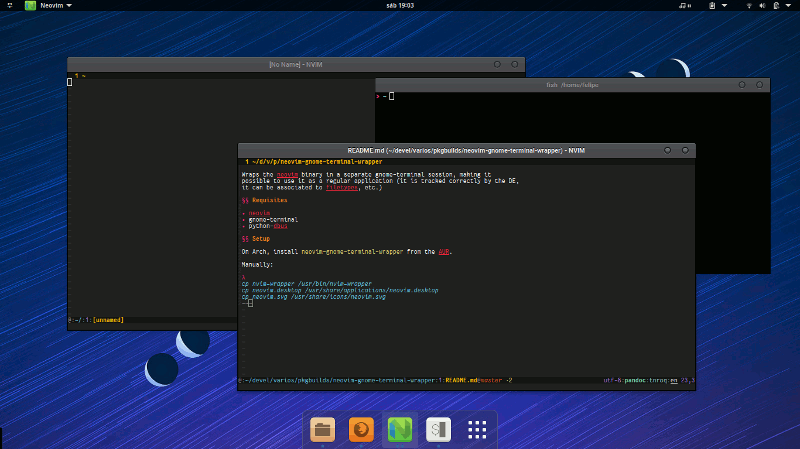

# neovim-gnome-terminal-wrapper

Wraps the neovim binary in a separate gnome-terminal session, making it
possible to use it as a regular application (it is tracked correctly by the DE,
it can be associated to filetypes, etc.)

## Requisites

* neovim
* gnome-terminal >= 3.16 (uses gnome-terminal-server)
* python-dbus

## Setup

On Arch, install `neovim-gnome-terminal-wrapper` from the AUR.

Manually:

~~~
cp nvim-wrapper /usr/bin/nvim-wrapper
cp neovim.desktop /usr/share/applications/neovim.desktop
cp neovim.svg /usr/share/icons/neovim.svg
~~~
