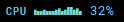

# graph-bars-font

[](https://stand-with-ukraine.pp.ua/)

OTF font with vertical bars for one-line ASCII spectrum analyzers, graphs, etc.




I didn't find anything similar on the net so I decided to make one myself.

I'm sharing it here since someone may also find it useful for sexy status lines. :)

# Usage

There are 9 glyphs in this font:


1. For Linux: copy `Bars-regular.otf` to `/usr/share/fonts/OTF/`. Create this folder if it does not exist.

   If you're using **Arch Linux**, you can install this font via AUR:

   ```sh
   yay -S graph-bars-font
   ```

2. Refer to it as "Bars". Here's an example on how I use it in Sway WM with `swaybar` (similar to `i3bar`):

    ```html
    <span font_desc="Bars">\u3001\u3002\u3003\u3006\u3005...</span>
    ```

# Credits

Made with [Glyphr Studio](https://www.glyphrstudio.com/online/) since I suck at FontForge...
