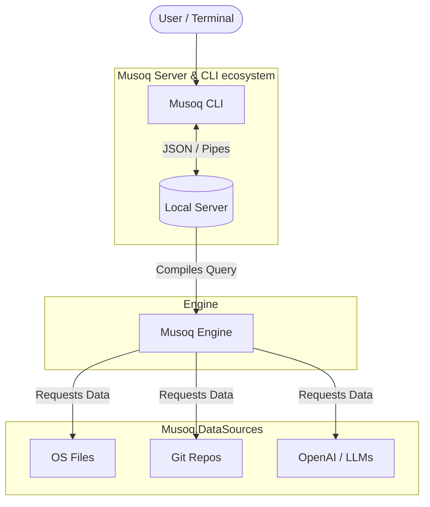
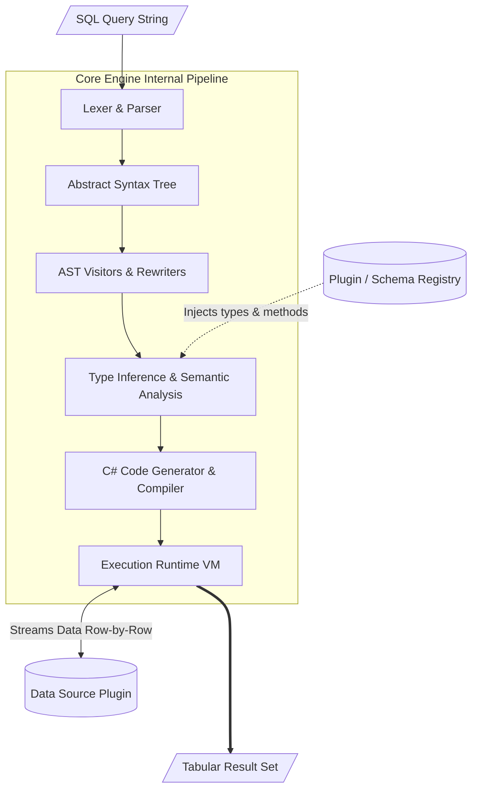

<!-- 
(Best practice: if you have a logo, place it here centered)
<p align="center">
  
</p> 
-->

```text
  ███╗   ███╗██╗   ██╗███████╗ ██████╗  ██████╗ 
  ████╗ ████║██║   ██║██╔════╝██╔═══██╗██╔═══██╗
  ██╔████╔██║██║   ██║███████╗██║   ██║██║   ██║
  ██║╚██╔╝██║██║   ██║╚════██║██║   ██║██║▄▄ ██║
  ██║ ╚═╝ ██║╚██████╔╝███████║╚██████╔╝╚██████╔╝
  ╚═╝     ╚═╝ ╚═════╝ ╚══════╝ ╚═════╝  ╚══▀▀═╝ 
        SQL Superpowers for Developers
```

# Musoq: SQL Superpowers for Developers

[](https://opensource.org/licenses/MIT)
[](https://github.com/Puchaczov/Musoq/graphs/code-frequency)
[](https://www.nuget.org/packages?q=musoq)


**Ad-hoc SQL queries against files, logs, processes, and more — with zero data ingestion or intermediate storage.**

<p align="center">
  
</p>

Musoq is built for **ad-hoc querying and investigation** — the moments when you want to ask a quick question about data that isn't already in a database: a log file, a git history, a binary dump, a CSV, a running process. The kind of question where writing a script feels like too much overhead, but `grep` alone isn't enough.

Instead of a script, you write a query.

*Musoq extends standard SQL with declarative inline **text parsing**, **binary decoding**, and cross-source data joins — defined directly inside the query.*

📚 **[Read the Full Documentation](https://github.com/Puchaczov/Musoq/wiki)** *(Or run `Musoq --help` in your terminal)*

## Table of Contents

- [The Motivation: Bash vs. SQL](#-the-motivation-bash-vs-sql)
- [Quick Start & Installation](#-quick-start--installation)
- [Beyond Standard SQL](#-beyond-standard-sql)
  - [Inline Binary Decoding](#1-inline-binary-decoding)
  - [Declarative Text Log Parsing](#2-declarative-text-log-parsing)
  - [Strong Typing for Dynamic Data](#3-strong-typing-for-dynamic-data-table--couple)
- [The Developer Toolbox](#-the-developer-toolbox-beyond-ad-hoc-queries)
- [How Musoq Fits in the Ecosystem](#-how-does-musoq-fit-into-the-sql-tooling-ecosystem)
- [A Universe of Data Sources](#-available-data-sources)
- [Ecosystem Architecture](#-the-musoq-ecosystem)

---

## 💡 The Motivation: Bash vs. SQL

Instead of maintaining a fragile chain of Bash commands:
```bash
find . -name "*.js" -exec wc -l {} \; | awk '{sum+=$1} END {print sum}'
```

Write declarative, readable SQL:
```sql
select Sum(Length(f.GetFileContent())) as TotalLines
from os.files('.', true) f
where f.Extension = '.js'
```

---

## 🚀 Quick Start & Installation

To actually execute Musoq queries locally, you need the CLI application. Since Musoq by itself is just the engine, the CLI and Server handles compiling your query and returning formatted results (in tables, JSON, CSV, Yaml, etc.).

### 1. Install CLI
*(no additional dependencies required)*

**Powershell (Windows)**
```powershell
irm https://raw.githubusercontent.com/Puchaczov/Musoq.CLI/refs/heads/main/scripts/powershell/install.ps1 | iex
```

**Shell using curl (Linux / macOS)**
```shell
curl -fsSL https://raw.githubusercontent.com/Puchaczov/Musoq.CLI/refs/heads/main/scripts/bash/install.sh | sudo bash
```

*(Prefer a manual install? Download the standalone binary from our [Releases](https://github.com/Puchaczov/Musoq.CLI/releases) page.)*

### 2. Install Data Sources
Musoq is highly modular. You install data sources via the built-in registry to unlock new tables and schemas.

```bash
Musoq datasource install os --registry
Musoq datasource install git --registry
Musoq datasource install separatedvalues --registry
```

### 3. Run your first queries
Open a terminal, start a background server, and fire away!
```bash
# 1. Start the local agent server
Musoq serve

# 2. Who is consuming all the space?
Musoq run "select Name, Length from os.files('/home', true) order by Length desc take 10"

# 3. Look at recent commits
Musoq run "select c.Sha, c.Message, c.Author from git.repository('.') r cross apply r.Commits c"

# 4. Stop the server when done
Musoq quit
```

---

## ✨ Beyond Standard SQL

Musoq doesn't just read tables; it **understands raw data formats inline**. You don't need a custom plugin to query weird file formats if you can describe them.

*Querying standard CSVs and JSON is easy, but Musoq's real power is understanding raw data formats...*

### 1. Inline Binary Decoding (`binary` schemas)
Reading a custom binary file usually means opening a hex editor or writing a C# `BinaryReader` wrapper. With Musoq, you declare the binary layout right above your query:

```sql
-- Declare your binary struct right in the script!
binary GameSaveHeader {
    Magic:    int le,
    Version:  short le,
    PlayerId: byte[16],
    Score:    int le
}

-- Query the raw bytes from the file using the declaration
select 
    h.Version, 
    ToHex(h.PlayerId) as UID, 
    h.Score 
from os.file('/saves/save1.dat') f
cross apply Interpret(f.GetBytes(), GameSaveHeader) h
where h.Magic = 0x4D414745 -- 'GAME'
```

### 2. Declarative Text Log Parsing (`text` schemas)
Parsing a badly formatted application log without Musoq usually means chaining regex patterns that are hard to read and harder to maintain. Musoq lets you describe the structure inline instead:

```sql
-- Describe what the log looks like inline
text LogEntry {
    Timestamp: between '[' ']',
    _:         literal ' ',
    Level:     until ':',
    _:         literal ': ',
    Message:   rest
}

-- Stream it, parse it, query it!
select log.Timestamp, log.Level, log.Message
from os.file('/var/logs/app.log') f
cross apply Lines(f.GetContent()) line
cross apply Parse(line.Value, LogEntry) log
where log.Level = 'ERROR'
```

### 3. Strong Typing for Dynamic Data (`table` & `couple`)
CSV, JSON, and LLMs often return untyped string data. Musoq lets you define strong types and "couple" them with dynamic datasources to enforce sanity:

```sql
table Receipt {
    Shop: string,
    ProductName: string,
    Price: decimal
};

-- Bind untyped AI-vision extraction output to strict SQL Types
couple stdin.LlmExtractFromImage() with table Receipt as SourceOfReceipts;

select s.Shop, s.ProductName, s.Price 
from SourceOfReceipts('OpenAi', 'gpt-4o') s
where s.Price > 100.00
```

---

## 🧰 The Developer Toolbox: Supporting Ad-Hoc Workflows

The CLI is designed around the ad-hoc investigation workflow — quickly reaching for data, shaping it, and moving on. Beyond one-liners, it also supports saving frequent queries as tools and exposing them to AI agents.

### 1. First-Class `stdin` Piping
You don't always want to query files on disk. Musoq has native support for intercepting streamed `stdin` data and structuring it on the fly using zero-copy memory-mapped buffers:

```bash
# Query JSON output from other CLI tools instantly
kubectl get pods -o json | musoq run "select * from stdin.JsonFlat() where path like '%status.phase' and value = 'Running'"

# Apply regex directly to a live command stream
cat app.log | musoq run "select * from stdin.Regex('(?<timestamp>.*?)\\s+(?<level>.*?)\\s+(?<message>.*)') where level = 'ERROR'"
```

### 2. Parameterized Tools
Instead of retyping complex queries, you can save them as **Tools** using YAML and Scriban templates. 

```bash
# Execute a saved tool with dynamic arguments
Musoq tool execute search_commits --author "John Doe" --since "2024-01-01"
```

### 3. Native Model Context Protocol (MCP) Server
By enabling the built-in MCP server (`musoq set mcp-enabled true`), Musoq exposes your parameterized tools as callable functions to AI agents like Claude, Cursor, or GitHub Copilot. 

You can create isolated "Contexts" so your AI assistant can safely query your active git history, search local file hierarchies, or parse your API responses using SQL, without writing any integration code.

---

## 🆚 How does Musoq fit into the SQL tooling ecosystem?

There are several excellent tools that allow you to use SQL outside of traditional databases. While they share a similar syntax, they are fundamentally designed to solve different classes of problems:

| Tool | Primary Focus | Best Suited For |
|---|---|---|
| **DuckDB** | Analytical Workloads (OLAP) | Aggregating and analyzing large, structured datasets (Parquet, CSV, JSON) at extremely high speeds. |
| **Steampipe** | Cloud Infrastructure | Querying cloud APIs (AWS, Azure, GitHub) as foreign tables for compliance, auditing, and DevSecOps. |
| **osquery** | Endpoint Monitoring | Tracking the state, metrics, and security configurations across fleets of operating systems. |
| **Musoq** | Ad-hoc Querying & Investigation | One-off queries, debugging sessions, and local investigations against files, logs, binary data, and `stdin` — without importing or storing anything. |

While tools like DuckDB and Steampipe excel when data is already naturally structured or API-driven, Musoq is built for the investigative, exploratory side of development — when you don't know the shape of the data yet and you want to ask questions first. It gives you the primitives (inline `text` matchers, `binary` schemas, and AI `couple` statements) to define structure *during* the query, not before it.

Importantly, **Musoq does not use an underlying database engine** (like SQLite or Postgres FDWs). There is no "import" step, no data ingestion, and no intermediate storage. Musoq is a pure runtime that streams and transforms data exactly where it resides—whether that's a file on disk, an API response, or `stdin`—and outputs the result directly.

---

## 🔌 Available Data Sources

You can query APIs, files, and services as logical tables using our growing library of [Musoq Data Sources](https://github.com/Puchaczov/Musoq.DataSources):

- **Development**: C# Code Analysis (Roslyn), Git (tags, diffs, line history)
- **Infrastructure**: Docker (containers, images, logs), Kubernetes, System OS
- **Files**: JSON, CSV, Archives (Zip/Tar), Flat files
- **AI & Integrations**: OpenAI/Ollama (Unstructured extractions!), Airtable, CANBus
- **Databases**: Postgres, SQLite

*(Tip: Just run `desc schema` or `desc schema.table(args)` inside Musoq to explore what is queryable.)*

---

## 🧩 The Musoq Ecosystem

Musoq is highly modular and built with extensibility at its core. Here is how the components interact:


```mermaid
flowchart TD
    User([User / Terminal]) --> CLI
    
    subgraph Musoq.AgentLocal [Musoq Server & CLI ecosystem]
        CLI[Musoq CLI]
        LocalHost[(Local Server)]
        CLI <-->|JSON / Pipes| LocalHost
    end

    subgraph Core [Engine]
        Engine[Musoq Engine]
        LocalHost -->|Compiles Query| Engine
    end
    
    subgraph Plugins [Musoq.DataSources]
        DS_OS[OS Files]
        DS_Git[Git Repos]
        DS_AI[OpenAI / LLMs]
        Engine -->|Requests Data| DS_OS
        Engine -->|Requests Data| DS_Git
        Engine -->|Requests Data| DS_AI
    end
```

It is divided into 3 key projects:

1. **[Musoq](https://github.com/Puchaczov/Musoq)** (You are here): The core MIT-licensed SQL engine language and AST runtime. Designed to be extended with new data sources.
2. **[Musoq.DataSources](https://github.com/Puchaczov/Musoq.DataSources)**: The MIT-licensed repository containing all the plugins (Git, OS, Postgres, OpenAI, Archives).
3. **[Musoq.CLI & Musoq.AgentLocal](https://github.com/Puchaczov/Musoq.CLI)**: A lightweight background server & CLI that executes the Musoq query language locally. Not yet open sourced, but free to use.

### Deep Dive: Engine Architecture

When a query enters the core **Musoq Engine**, it goes through the following pipeline:


```mermaid
flowchart TD
    SQL[/SQL Query String/] --> Parser
    
    subgraph Engine [Core Engine Internal Pipeline]
        direction TB
        Parser[Lexer & Parser] --> AST[Abstract Syntax Tree]
        AST --> Visitors[AST Visitors & Rewriters]
        Visitors --> Semantic[Type Inference & Semantic Analysis]
        Semantic --> Compiler[C# Code Generator & Compiler]
        Compiler --> Runtime[Execution Runtime VM]
    end
    
    Registry[(Plugin / Schema Registry)] -.->|Injects types & methods| Semantic
    Runtime <-->|Streams Data Row-by-Row| DataSource[(Data Source Plugin)]
    Runtime ===> Results[/Tabular Result Set/]
```

## 🤖 Extensibility & AI-Driven Agent Plugins
You can write C# or Python plugins manually, or point an AI agent at the plugin development guide and have it build one for you.

We provide a dedicated, self-contained guide designed explicitly for Autonomous Coding Agents (like GitHub Copilot, Cursor, or Claude) to build, test, package, and deploy complete .NET plugins without human intervention. Just point your agent at the docs and tell it what data source you want!

Check out the [🤖 Autonomous Plugin Development Guide (in Musoq.DataSources)](https://github.com/Puchaczov/Musoq.DataSources/blob/main/MusoqAutonomousPluginDevelopment.md) to bootstrap your first AI-generated plugin.

---

*"Why write loops, when you can write queries?"*

---

## 📜 License

This project is licensed under the MIT License - see the [LICENSE](LICENSE) file for details. This means Musoq is free for both non-commercial and commercial use.

# Musoq.DataSources

This project contains data sources for Musoq engine. Musoq data sources are plugins that allows musoq engine to treat external data sources as tables.

## 🚀 Create Your Own Plugin

Want to create a custom plugin for Musoq? We've got you covered! Check out our comprehensive plugin development resources:

- **[📖 Plugin Development Guide](PLUGIN_DEVELOPMENT.md)** - Complete guide with quick start, architecture, patterns, and best practices


Whether you're integrating APIs, databases, files, or any other data source, this guide will help you build powerful, SQL-queryable plugins for Musoq in minutes.

# Data sources

- Airtable (allows to query tables from Airtable)
- Archives (allows to treat archives as tables)
- CANBus (allows to treat CAN .dbc files and corresponding .csv files that contains records of a CAN bus as tables)
- Docker (allows to treat docker containers, images, etc as tables)

- FlatFile (allows to treat flat files as table)
- Json (allows to treat json files as tables)
- Kubernetes (allows to treat kubernetes pods, services, etc as tables)
- OpenAI (exists mainly to be combined with other plugins to allow fuzzy search by GPT models)
- Postgres (allows to treat postgres database as tables)
- SeparatedValues (allows to treat separated values files as tables)
- Sqlite (allows to treat sqlite database as tables)
- System (mostly utils, ranges and dual table resides here)
- Time (allows to treat time as table)
- Roslyn (allows to query C# code)

### To look at the engine itself go to [Musoq](https://github.com/Puchaczov/Musoq) repository.

# Musoq CLI

[](https://github.com/Puchaczov/Musoq.CLI/blob/main/LICENSE)

Musoq.CLI is a powerful command-line interface that brings the magic of [Musoq](https://github.com/Puchaczov/Musoq) to your fingertips. Query various data sources with ease, wherever they reside!

## 🌟 Features

- 🖥️ Spin up a Musoq server
- 🔍 Query diverse data sources
- 🔄 Seamless server-client interaction
- 📊 Multiple output formats (Raw, CSV, JSON, Interpreted JSON, Yaml, Interpreted Yaml)
- 🚫 No additional dependencies required

## 🚀 Easy Install / Update / Remove

### Install / Update

Powershell:

```powershell
irm https://raw.githubusercontent.com/Puchaczov/Musoq.CLI/refs/heads/main/scripts/powershell/install.ps1 | iex
```

Shell using curl:

```shell
curl -fsSL https://raw.githubusercontent.com/Puchaczov/Musoq.CLI/refs/heads/main/scripts/bash/install.sh | sudo bash
```

Shell using wget:

```shell
wget -qO- https://raw.githubusercontent.com/Puchaczov/Musoq.CLI/refs/heads/main/scripts/bash/install.sh | sudo bash
```

### Remove

Powershell:

```powershell
irm https://raw.githubusercontent.com/Puchaczov/Musoq.CLI/refs/heads/main/scripts/powershell/remove.ps1 | iex
```

Shell using curl:

```shell
curl -fsSL https://raw.githubusercontent.com/Puchaczov/Musoq.CLI/refs/heads/main/scripts/bash/remove.sh | sudo bash
```

Shell using wget:

```shell
wget -qO- https://raw.githubusercontent.com/Puchaczov/Musoq.CLI/refs/heads/main/scripts/bash/remove.sh | sudo sh
```

## 🏃 Quick Start

### With Server In Background

1. 📥 Install Musoq.CLI using the easy installation script above
2. 🖥️ Open any terminal
3. 🏃‍♂️ Run the server in background:
   - Windows & Linux: `Musoq serve`
4. 🔍 Run queries as needed
5. 🛑 To quit the server: `Musoq quit`

### With Server In Foreground

1. 📥 Install Musoq.CLI using the easy installation script above
2. 🖥️ Open one terminal and run the server:
   - Windows & Linux: `Musoq serve --wait-until-exit`
3. 🖥️ Open another terminal
4. 🔍 Run a query:
   - Windows & Linux: `Musoq run query "select 1 from #system.dual()"`
5. 🛑 To quit the server: `Musoq quit`

# Musoq Server & CLI Specification

---

## Table of Contents

1. [Introduction](#1-introduction)
2. [Architecture Overview](#2-architecture-overview)
3. [Installation & Environment](#3-installation--environment)
4. [Server Commands](#4-server-commands)
5. [Query Execution](#5-query-execution)
6. [Data Source Management](#6-data-source-management)
7. [Python Plugin Development](#7-python-plugin-development)
8. [Tool Management](#8-tool-management)
9. [Scripts Management](#9-scripts-management)
10. [Registry Management](#10-registry-management)
11. [Configuration Management](#11-configuration-management)
12. [Bucket Management](#12-bucket-management)
13. [MCP Context Management](#13-mcp-context-management)
14. [Utility Commands](#14-utility-commands)
15. [Specification Documents](#15-specification-documents)
16. [API Reference](#16-api-reference)
17. [Exit Codes & Error Handling](#17-exit-codes--error-handling)
18. [Configuration Files](#18-configuration-files)
19. [Examples & Workflows](#19-examples--workflows)
20. [Security Considerations](#20-security-considerations)

---

## 1. Introduction

### 1.1 Purpose

This specification defines the Musoq server and command-line interface (CLI). The server provides a local execution environment for Musoq SQL queries, enabling developers to query diverse data sources through a unified interface.

### 1.2 Scope

This specification covers:

- CLI command structure and syntax
- Server lifecycle management
- Data source plugin management (both .NET and Python)
- Python plugin development contract
- Tool definition and execution
- SQL script management
- Plugin registry configuration
- Configuration and environment variables
- REST API endpoints for programmatic access
- Error handling and exit codes
- Configuration file formats
- Security considerations

### 1.3 Design Philosophy

The Musoq CLI follows these principles:

- **Discoverability**: Commands are organized hierarchically with consistent patterns
- **Composability**: Output formats support piping and scripting
- **Offline-First**: By default, it doesn't connect anywhere, doesn't send any telemetry, can work fully offline
- **Extensibility**: Plugin architecture for data sources and tools

### 1.4 Command Structure

All CLI commands follow this general pattern:

```
musoq <command> [subcommand] [arguments] [options]
```

Commands are case-insensitive. Options use the standard `--option` or `-o` format.

### 1.5 Terminology

| Term | Definition |
|------|------------|
| **Server** | The local server that executes queries and manages plugins |
| **Data Source** | A plugin that provides access to a specific type of data |
| **Schema** | The named interface exposed by a data source for SQL queries |
| **Tool** | A predefined SQL query template with parameters |
| **Script** | A saved SQL query file |
| **Registry** | A remote source for discovering and downloading plugins |
| **Bucket** | An isolated context for query execution with preloaded data |

---

## 2. Architecture Overview

### 2.1 Component Architecture

```
┌─────────────────────────────────────────────────────────────────┐
│                         CLI (musoq)                             │
│  ┌─────────────────────────────────────────────────────────────┐│
│  │ Commands: serve, run, datasource, tool, scripts, registry   ││
│  └─────────────────────────────────────────────────────────────┘│
└────────────────────────────┬────────────────────────────────────┘
                             │ HTTP / Named Pipes
                             ▼
┌─────────────────────────────────────────────────────────────────┐
│                         API Server                              │
│  ┌──────────────┐  ┌──────────────┐  ┌────────────────────────┐ │
│  │ Controllers  │  │ CQRS Handlers│  │ Query Execution Engine │ │
│  └──────────────┘  └──────────────┘  └────────────────────────┘ │
└────────────────────────────┬────────────────────────────────────┘
                             │
                             ▼
┌─────────────────────────────────────────────────────────────────┐
│                      Data Source Plugins                        │
│  ┌──────────┐  ┌──────────┐  ┌──────────┐  ┌─────────────────┐  │
│  │ .NET     │  │ Python   │  │ Built-in │  │ External (.zip) │  │
│  │ Plugins  │  │ Plugins  │  │ Sources  │  │ Packages        │  │
│  └──────────┘  └──────────┘  └──────────┘  └─────────────────┘  │
└─────────────────────────────────────────────────────────────────┘
```

### 2.2 Communication Model

The CLI communicates with the API server through:

1. **HTTP REST API**: For management operations
2. **Named Pipes**: For pipe feeding data into queries

### 2.3 Server Lifecycle

The server operates in two modes:

| Mode | Command | Behavior |
|------|---------|----------|
| Background | `musoq serve` | Starts as detached process, returns immediately |
| Foreground | `musoq serve --wait-until-exit` | Blocks until explicitly stopped |

---

## 3. Installation & Environment

### 3.1 Prerequisites

| Requirement | Version | Purpose |
|-------------|---------|---------|
| Python (optional) | 3.12 | Python plugin support via Python.NET |

---

## 4. Server Commands

### 4.1 serve - Start Server

Start the local server.

```
musoq serve [options]
```

**Options:**

| Option | Description | Default |
|--------|-------------|---------|
| `--wait-until-exit` | Run in foreground, block until stopped | false |
| `--auto-shutdown` | Enable auto-shutdown after idle period | false |
| `--is-independent-process` | Internal flag for subprocess mode | false |

**Examples:**

```bash
# Start server in background (returns immediately)
musoq serve

# Start server in foreground (blocks)
musoq serve --wait-until-exit

# Start with auto-shutdown enabled (shuts down after 10 minutes of inactivity)
musoq serve --wait-until-exit --auto-shutdown
```

**Output on Success:**
```
███    ███ ██    ██ ███████  ██████   ██████ 
████  ████ ██    ██ ██      ██    ██ ██    ██
██ ████ ██ ██    ██ ███████ ██    ██ ██    ██ 
██  ██  ██ ██    ██      ██ ██    ██ ██ ▄▄ ██
██      ██  ██████  ███████  ██████   ██████  
                                         ▀▀   
Server is up and running
```

### 4.2 quit - Stop Server

Stop the running Musoq server.

```
musoq quit
```

**Exit Codes:**
- `0`: Server stopped successfully
- `2`: Server was not running or communication failed

---

## 5. Query Execution

### 5.1 run - Execute Queries

Execute SQL queries from strings, script names, or files.

```
musoq run <input> [options]
```

**Arguments:**

| Argument | Description |
|----------|-------------|
| `<input>` | SQL query string, script name, or file path (with `--from-file`) |

**Options:**

| Option | Description | Default |
|--------|-------------|---------|
| `--bucket <name>` | Bucket name for query context | None |
| `--format <format>` | Output format (see table below) | `table` |
| `--execute <expr>` | Expression to execute on results | None |
| `--debug` | Show transformed query before execution | false |
| `--unquoted` | Disable quoting in CSV output | false |
| `--no-header` | Skip header row in output | false |
| `--stacktrace` | Include stack trace in error output | false |
| `--execution-details` | Show execution phase and progress details | false |
| `--from-file` | Treat input as file path | false |

**Examples:**

```bash
# Execute inline query
musoq run "SELECT 1 FROM #system.dual()"

# Execute with JSON output
musoq run "SELECT * FROM #os.files('.')" --format json

# Execute script by name (looks up in ~/.musoq/Scripts/)
musoq run my_script

# Execute from file
musoq run ./queries/analysis.sql --from-file

# Debug mode - shows the actual query sent to the server
musoq run "SELECT * FROM #os.files('.')" --debug

# Pipe-friendly CSV output without headers
musoq run "SELECT Name, Size FROM #os.files('.')" --format csv --no-header

# Show execution progress for long-running queries
musoq run "SELECT * FROM #os.files('/', true)" --execution-details
```

### 5.2 Standard Input Piping

Queries can reference piped data using the `#stdin` schema:

```bash
# Pipe CSV data
cat data.csv | musoq run "SELECT * FROM #stdin.csv(true, 0)"

# Pipe JSON data
cat data.json | musoq run "SELECT * FROM #stdin.json()"

# Chain with other tools
curl https://api.example.com/data | musoq run "SELECT id, name FROM #stdin.json() WHERE active = true"
```

### 5.3 Output Formats

| Format | Response Format | Description | Use Case |
|--------|-----------------|-------------|----------|
| `table` | raw | ASCII table (default) | Human-readable terminal output |
| `json` | json | JSON array of objects | API integration, jq processing |
| `csv` | csv | Comma-separated values | Spreadsheet import, further processing |
| `yaml` | yaml | YAML format | Configuration files, readability |
| `raw` | raw | Raw values, newline-separated | Simple scripting |
| `interpreted_json` | json | Interpreted JSON (preserves structure) | Structured data extraction |
| `reconstructed_json` | json | Reconstructed JSON (path-value mode) | Flattened JSON output |
| `interpreted_yaml` | yaml | Interpreted YAML (preserves structure) | Structured data as YAML |
| `reconstructed_yaml` | yaml | Reconstructed YAML (path-value mode) | Flattened YAML output |

### 5.4 Script Resolution

When the input doesn't look like a SQL query, the CLI attempts to resolve it as a script:

1. Check if input ends with `.sql` - treat as script name
2. Look up script in `~/.musoq/Scripts/{name}.sql`
3. If found, execute the script contents
4. If not found, treat input as a raw query

### 5.5 Query Transformation

The CLI performs the following transformations before execution:

1. **Expression to Query**: Simple expressions like `1 + 1` are wrapped in `SELECT ... FROM #system.dual()`
2. **Stdin Rewriting**: References to `#stdin` are rewritten with appropriate model configurations for AI extraction

---

## 6. Data Source Management

The `datasource` command manages installed data source plugins, including both .NET assemblies and Python scripts.

### 6.1 Plugin Types

| Type | Description | Location |
|------|-------------|----------|
| `DotNet` | Compiled .NET assemblies | `~/.musoq/DataSources/` |
| `Python` | Python v.2 plugin projects | `~/.musoq/Python/Scripts/` |
| `BuiltIn` | Plugins bundled with Musoq | Application directory |

### 6.2 datasource list

List all installed data sources.

```
musoq datasource list
```

**Output Columns:**

| Column | Description |
|--------|-------------|
| Name | Data source identifier (used in `datasource show`) |
| Version | Installed version (semantic versioning) |
| Type | Plugin type: `DotNet`, `Python`, or `BuiltIn` |
| Enabled | Whether the data source is active (`Yes`/`No`) |
| Installed At | Installation timestamp (UTC) |

**Example Output:**
```
┌──────────────────────────────┬─────────┬────────┬─────────┬─────────────────────┐
│ Name                         │ Version │ Type   │ Enabled │ Installed At        │
├──────────────────────────────┼─────────┼────────┼─────────┼─────────────────────┤
│ Musoq.DataSources.Roslyn     │ 7.2.0   │ DotNet │ Yes     │ 2024-12-15 10:30:00 │
│ weather_api                  │ 1.0.0   │ Python │ Yes     │ 2024-12-16 14:20:00 │
└──────────────────────────────┴─────────┴────────┴─────────┴─────────────────────┘
```

### 6.3 datasource show

Show detailed information about a specific data source.

```
musoq datasource show <name>
```

**Output Fields:**

| Field | Description |
|-------|-------------|
| Name | Data source identifier |
| Version | Installed version |
| Type | Plugin type |
| Enabled | Active status |
| Installed | Installation timestamp |
| Path | Filesystem path to the plugin |
| Entry Point | Main assembly or script file |
| Architecture | Target architecture (x64, arm64, any) |
| Platform | Target platform (windows, linux, osx, any) |

**Example Output:**
```
Musoq.DataSources.Roslyn

Version:      7.2.0
Type:         DotNet
Enabled:      Yes
Installed:    2024-12-15 10:30:00
Path:         /home/user/.musoq/DataSources/Musoq.DataSources.Roslyn
Entry Point:  Musoq.DataSources.Roslyn.dll
Architecture: x64
Platform:     linux
```

### 6.4 datasource install

Install a data source from the plugin registry.

```
musoq datasource install <name> [options]
```

**Arguments:**

| Argument | Description |
|----------|-------------|
| `<name>` | Plugin name (short or full, e.g., `roslyn` or `Musoq.DataSources.Roslyn`) |

**Options:**

| Option | Description | Default |
|--------|-------------|---------|
| `-v, --version <VERSION>` | Specific version to install | latest |
| `--offline` | Use cached registry only | false |
| `--non-interactive` | Plain text progress output (for CI/CD) | false |

**Examples:**

```bash
# Install latest version (uses short name)
musoq datasource install roslyn

# Install using full package name
musoq datasource install Musoq.DataSources.Roslyn

# Install specific version
musoq datasource install Musoq.DataSources.Roslyn --version 7.1.0

# Non-interactive mode for CI/CD pipelines
musoq datasource install Musoq.DataSources.Roslyn --non-interactive
```

**Interactive Progress:**
```
Installing Musoq.DataSources.Roslyn v7.2.0...
  ━━━━━━━━━━━━━━━━━━━━━━━━━━━━━━━━━━━━━━━━ 100% 0:00:02
✓ Successfully installed Musoq.DataSources.Roslyn (v7.2.0)
```

### 6.5 datasource import

Import a data source from a local path or zip file.

```
musoq datasource import <path> [options]
```

**Arguments:**

| Argument | Description |
|----------|-------------|
| `<path>` | Path to plugin directory or zip file |

**Options:**

| Option | Description | Default |
|--------|-------------|---------|
| `--name <name>` | Custom name for imported plugin | Derived from path |
| `--non-interactive` | Plain text progress output | false |

**Examples:**

```bash
# Import from directory
musoq datasource import /path/to/plugin

# Import from zip file
musoq datasource import ./plugin.zip

# Import with custom name
musoq datasource import ./plugin.zip --name my-custom-plugin
```

### 6.6 datasource uninstall

Uninstall a data source.

```
musoq datasource uninstall <name>
```

**Example:**
```bash
musoq datasource uninstall Musoq.DataSources.Roslyn
# Output: Successfully uninstalled data source 'Musoq.DataSources.Roslyn'
```

### 6.7 datasource create

Create a new Python data source from a template.

```
musoq datasource create <name> [options]
```

**Arguments:**

| Argument | Description |
|----------|-------------|
| `<name>` | Name for the new Python data source (alphanumeric, underscores allowed) |

**Options:**

| Option | Description | Default |
|--------|-------------|---------|
| `-t, --template <template>` | Template type | `basic` |

**Available Templates:**

| Template | Description | Use Case |
|----------|-------------|----------|
| `basic` | Minimal plugin with single data source | Simple data providers |
| `api` | HTTP API integration template | REST API wrappers |
| `database` | Database connection template | Database connectors |

**Examples:**

```bash
# Create basic plugin
musoq datasource create weather_data

# Create API-based plugin
musoq datasource create github_stats --template api

# Create database plugin
musoq datasource create postgres_analytics --template database
```

### 6.8 datasource search

Search for data sources in the plugin registry.

```
musoq datasource search [query] [options]
```

**Arguments:**

| Argument | Description |
|----------|-------------|
| `[query]` | Optional search term (searches name, description, tags) |

**Options:**

| Option | Description | Default |
|--------|-------------|---------|
| `--offline` | Search cached registry only | false |

**Examples:**

```bash
# List all available plugins
musoq datasource search

# Search for specific plugin
musoq datasource search postgres

# Search by tag
musoq datasource search database
```

**Example Output:**
```
┌──────────┬─────────────────────────────────┬─────────┬────────────────────────────────┐
│ Name     │ Full Name                       │ Version │ Description                    │
├──────────┼─────────────────────────────────┼─────────┼────────────────────────────────┤
│ postgres │ Musoq.DataSources.Postgres      │ 7.2.0   │ Query PostgreSQL databases     │
│ sqlite   │ Musoq.DataSources.SQLite        │ 7.2.0   │ Query SQLite databases         │
└──────────┴─────────────────────────────────┴─────────┴────────────────────────────────┘

Hint: Use 'musoq datasource install <name>' to install a plugin.
```

### 6.9 datasource folder

Show or open the data sources folder.

```
musoq datasource folder [name] [options]
```

**Arguments:**

| Argument | Description |
|----------|-------------|
| `[name]` | Optional: specific data source name |

**Options:**

| Option | Description |
|--------|-------------|
| `--open` | Open folder in file explorer |

**Examples:**

```bash
# Show root data sources folder path
musoq datasource folder
# Output: /home/user/.musoq/DataSources

# Open specific plugin folder
musoq datasource folder my_plugin --open

# Open root folder
musoq datasource folder --open
```

### 6.10 datasource update

Update installed data sources from their registries.

```bash
musoq datasource update
```

### 6.11 datasource set-source

Set the installation source for a data source.

```bash
musoq datasource set-source <name> <source>
```

**Arguments:**

| Argument | Description |
|----------|-------------|
| `<name>` | Name of the data source |
| `<source>` | Source URL or registry reference |

---

## 7. Python Plugin Development

Python plugins enable developers to create custom data sources using Python scripts. Musoq uses Python.NET to integrate Python code into the query engine.

### 7.1 Plugin Version

Musoq supports **v.2** Python plugins exclusively. The v.2 format uses a project-based structure with a directory containing `main.py` as the entry point. Flat `.py` files (v.1 format) are **no longer supported**.

### 7.2 Project Structure

Every v.2 plugin is a project directory:

```
~/.musoq/Python/Scripts/
└── my_plugin/                    # Plugin project name
    ├── main.py                   # REQUIRED: Plugin entry point
    ├── requirements.txt          # Optional: Python dependencies (auto-installed)
    ├── project.json              # Optional: Plugin metadata
    └── helpers.py                # Optional: Supporting modules
```

**Key Requirements:**

- `main.py` is **required** and must contain the `DataPlugin` class
- Project name (directory name) must be alphanumeric with underscores
- Additional `.py` files are optional for code organization
- Plugin is automatically discovered when directory contains `main.py`

### 7.3 DataPlugin Contract

Every Python plugin must implement this exact contract:

```python
class DataPlugin:
    """Complete v.2 plugin contract - ALL METHODS REQUIRED"""
    
    def schema_name(self) -> str:
        """
        Return the schema name used in SQL queries.
        Must be alphanumeric (underscores allowed), unique across plugins.
        
        Example: return "mydata"
        SQL Usage: SELECT * FROM #mydata.method()
        """
        pass
    
    def data_sources(self) -> list[str]:
        """
        Return list of data source method names.
        Each name becomes a SQL-callable method.
        
        Example: return ["users", "posts", "summary"]
        """
        pass
    
    def schemas(self) -> dict[str, dict[str, str]]:
        """
        Return column schemas for each data source.
        Keys MUST match data_sources() names.
        
        Example:
            return {
                "users": {"id": "int", "name": "str", "email": "str"},
                "posts": {"id": "int", "user_id": "int", "title": "str"}
            }
        """
        pass
    
    def initialize(self) -> None:
        """Initialize plugin (called once at load time)."""
        pass
    
    def get_required_env_vars(self, method_name: str) -> dict[str, bool]:
        """
        Return required environment variables for method.
        True = required (query fails if missing)
        False = optional (uses default)
        
        Example: return {"API_KEY": True, "API_ENDPOINT": False}
        """
        pass
    
    def get_required_execute_arguments(self, method_name: str) -> list[tuple[str, str]]:
        """
        Return parameter definitions for method.
        
        Example: return [("minimum_id", "int"), ("name_filter", "str")]
        """
        pass
    
    def execute(self, method_name: str, environment_variables: dict[str, str], *args):
        """
        Execute data source method and yield rows.
        
        Args:
            method_name: Data source method to execute
            environment_variables: Runtime environment variables
            *args: Parameters from SQL query
        
        MUST be a generator (use yield, not return).
        MUST yield dictionaries with keys matching schema.
        """
        pass
    
    def dispose(self) -> None:
        """Cleanup resources (called at unload)."""
        pass

# Module-level instance (REQUIRED)
plugin = DataPlugin()
```

### 7.4 Supported Types

| Type String | Python Type | SQL Type | Example |
|-------------|-------------|----------|---------|
| `"int"` | `int` | INTEGER | `42` |
| `"str"` | `str` | VARCHAR | `"hello"` |
| `"float"` | `float` | FLOAT | `3.14` |
| `"bool"` | `bool` | BOOLEAN | `True` |
| `"datetime"` | `str` | DATETIME | `"2024-12-01 15:30:00"` |

**DateTime Format:** Use ISO 8601 format: `YYYY-MM-DD HH:MM:SS`

### 7.5 Automatic Dependency Installation

When a plugin includes `requirements.txt`, Musoq automatically installs dependencies during plugin discovery:

**requirements.txt:**
```txt
requests>=2.31.0
pandas==2.1.0
python-dateutil>=2.8.2
```

### 7.6 Local Module Imports

Python plugins can import from local modules in the same directory:

**Project Structure:**
```
~/.musoq/Python/Scripts/hackernews/
├── main.py          # Entry point
├── http_client.py   # HTTP utilities
├── parsers.py       # Data parsing logic
└── requirements.txt # External dependencies
```

**main.py:**
```python
from http_client import fetch_json
from parsers import parse_story

class DataPlugin:
    def execute(self, method_name, environment_variables, *args):
        data = fetch_json("https://api.example.com/stories")
        for item in data:
            yield parse_story(item)

plugin = DataPlugin()
```

### 7.7 Environment Variables

Access environment variables in the `execute` method:

```python
def execute(self, method_name, environment_variables, *args):
    # Get with default
    api_key = environment_variables.get("API_KEY", "")
    endpoint = environment_variables.get("API_URL", "https://default.com")
    
    # Get with validation
    api_key = environment_variables.get("API_KEY")
    if not api_key:
        raise ValueError("API_KEY required")
    
    # Type conversion
    timeout = int(environment_variables.get("TIMEOUT", "30"))
```

### 7.8 Complete Example

**main.py:**
```python
"""Weather data plugin with current and forecast data sources."""
from datetime import datetime

class DataPlugin:
    def schema_name(self):
        return "weather"
    
    def data_sources(self):
        return ["current", "forecast"]
    
    def schemas(self):
        return {
            "current": {
                "city": "str",
                "temperature": "float",
                "humidity": "int",
                "conditions": "str",
                "timestamp": "datetime"
            },
            "forecast": {
                "city": "str",
                "date": "str",
                "high_temp": "float",
                "low_temp": "float",
                "precipitation": "int"
            }
        }
    
    def initialize(self):
        pass
    
    def get_required_env_vars(self, method_name):
        return {"WEATHER_API_KEY": True, "WEATHER_API_URL": False}
    
    def get_required_execute_arguments(self, method_name):
        return [("city", "str")]
    
    def execute(self, method_name, environment_variables, *args):
        api_key = environment_variables.get("WEATHER_API_KEY")
        if not api_key:
            raise ValueError("WEATHER_API_KEY required")
        
        city = args[0] if args else "London"
        
        if method_name == "current":
            yield {
                "city": city,
                "temperature": 22.5,
                "humidity": 65,
                "conditions": "Partly Cloudy",
                "timestamp": datetime.now().strftime("%Y-%m-%d %H:%M:%S")
            }
        elif method_name == "forecast":
            for i in range(5):
                yield {
                    "city": city,
                    "date": f"2024-12-{i+1:02d}",
                    "high_temp": 24.0 - i,
                    "low_temp": 15.0 - i,
                    "precipitation": 10 * (i + 1)
                }
    
    def dispose(self):
        pass

plugin = DataPlugin()
```

**SQL Usage:**
```sql
SELECT * FROM #weather.current('Paris')
SELECT * FROM #weather.forecast('London') WHERE precipitation > 20
```

### 7.9 Plugin Metadata (Runtime)

When a Python plugin is loaded, Musoq extracts the following metadata:

| Property | Description |
|----------|-------------|
| `ProjectName` | Directory name containing the plugin |
| `ProjectPath` | Full path to the project directory |
| `MainScriptPath` | Path to `main.py` |
| `SchemaName` | Value from `schema_name()` |
| `DataSources` | List of data source metadata |

**Per Data Source Metadata:**

| Property | Description |
|----------|-------------|
| `Name` | Data source method name |
| `Schema` | Column name → Type mapping |
| `ExecuteArguments` | List of (name, type) tuples |
| `EnvironmentVariables` | Variable name → Required flag |

### 7.10 Testing Python Plugins

**Standalone Testing:**

```python
def main():
    """Test plugin standalone."""
    plugin = DataPlugin()
    plugin.initialize()
    
    test_env = {"WEATHER_API_KEY": "test_key"}
    
    for row in plugin.execute("current", test_env, "Paris"):
        print(f"  {row}")
    
    plugin.dispose()

if __name__ == "__main__":
    main()
```

Run: `python main.py`

**Integration Testing via SQL:**

```sql
-- Test basic execution
SELECT * FROM #weather.current('London')

-- Test with filters
SELECT * FROM #weather.forecast('Paris') WHERE precipitation > 20

-- Test aggregation
SELECT COUNT(*) FROM #weather.forecast('Tokyo')
```

---

## 8. Tool Management

Tools are predefined SQL queries with dynamic parameters, stored as YAML files in `~/.musoq/Tools/`.

### 8.1 tool list

List available tools.

```
musoq tool list [options]
```

**Options:**

| Option | Description | Default |
|--------|-------------|---------|
| `--search <query>` | Filter tools by name or description | None |

**Example Output:**
```
┌──────────────────────┬─────────────────────────────────────────────┐
│ Name                 │ Description                                 │
├──────────────────────┼─────────────────────────────────────────────┤
│ weather              │ Get current weather for a city              │
│ file_analysis        │ Analyze files in a directory                │
│ docker_stats         │ Show container resource usage               │
└──────────────────────┴─────────────────────────────────────────────┘
```

### 8.2 tool show

Show detailed information about a specific tool.

```
musoq tool show <name>
```

**Example Output:**
```
Tool: weather
Description: Get current weather for a city

Query:
  SELECT city, temperature, conditions
  FROM #weather.current('{{city}}')
  WHERE temperature > {{min_temp}}

Output Format: table

Parameters:
  city (string, required)
    City name to query
  
  min_temp (int, optional, default: -50)
    Minimum temperature filter
```

### 8.3 tool execute

Execute a tool with dynamic parameters.

```
musoq tool execute <tool-name> [parameters...] [options]
```

**Parameter Passing:**

Parameters can be passed in two formats:

1. **Positional (key-value pairs):** `param1 value1 param2 value2`
2. **Named:** `--param1 value1 --param2 value2`

**Options:**

| Option | Description | Default |
|--------|-------------|---------|
| `--format <format>` | Output format override | Tool's default |
| `--debug` | Show processed query before execution | false |

**Examples:**

```bash
# Positional parameters
musoq tool execute weather city London

# Named parameters
musoq tool execute weather --city London

# Multiple parameters
musoq tool execute weather city London min_temp 10

# Mixed with options
musoq tool execute weather city London --format json --debug
```

**Debug Output:**
```
Processing query for tool 'weather'...
Processed Query:
  SELECT city, temperature, conditions
  FROM #weather.current('London')
  WHERE temperature > 10

Executing...
```

### 8.4 tool preview

Show how to execute a tool with placeholder parameters.

```bash
musoq tool preview <name>
```

### 8.5 tool create

Create a new tool from a template.

```bash
musoq tool create <name>
```

### 8.6 tool update

Open an existing tool for editing in the default editor.

```bash
musoq tool update <name>
```

### 8.7 tool clone

Clone an existing tool into a new tool.

```bash
musoq tool clone <source>
```

### 8.8 tool rename

Rename an existing tool.

```bash
musoq tool rename <name> <new-name>
```

### 8.9 tool delete

Delete an existing tool.

```bash
musoq tool delete <name>
```

### 8.10 tool folder

Show or open the tools folder.

```bash
musoq tool folder [options]
```

**Options:**

| Option | Description |
|--------|-------------|
| `--open` | Open folder in file explorer |

**Examples:**

```bash
# Show path
musoq tool folder
# Output: /home/user/.musoq/Tools

# Open folder
musoq tool folder --open
```

### 8.11 Tool Definition Format (YAML)

Tools are defined in YAML files with the following schema:

```yaml
name: weather
description: Get current weather for a city
query: |
  SELECT city, temperature, conditions
  FROM #weather.current('{{city}}')
  WHERE temperature > {{min_temp}}
output:
  format: table
parameters:
  - name: city
    type: string
    required: true
    description: City name to query
  - name: min_temp
    type: int
    required: false
    default: -50
    description: Minimum temperature filter
```

**Schema Reference:**

| Field | Type | Required | Description |
|-------|------|----------|-------------|
| `name` | string | Yes | Unique tool identifier |
| `description` | string | Yes | Human-readable description |
| `query` | string | Yes | SQL query with `{{parameter}}` placeholders |
| `output.format` | string | No | Default output format |
| `parameters` | array | No | List of parameter definitions |

**Parameter Definition Fields:**

| Field | Type | Required | Description |
|-------|------|----------|-------------|
| `name` | string | Yes | Parameter name (used in placeholders) |
| `type` | string | Yes | One of: `string`, `int`, `long`, `decimal`, `bool`, `datetime` |
| `required` | boolean | Yes | Whether the parameter must be provided |
| `default` | any | No | Default value (for optional parameters) |
| `description` | string | No | Human-readable description |

**Supported Parameter Types:**

| Type | Description | Example Values |
|------|-------------|----------------|
| `string` | Text value | `"London"`, `"SELECT * FROM table"` |
| `int` | 32-bit integer | `42`, `-100` |
| `long` | 64-bit integer | `9223372036854775807` |
| `decimal` | High-precision decimal | `123.456789` |
| `bool` | Boolean | `true`, `false` |
| `datetime` | ISO 8601 date/time | `"2024-12-01"`, `"2024-12-01 15:30:00"` |

### 8.12 Advanced Tool Examples

**File Analysis Tool:**
```yaml
name: file_analysis
description: Analyze files in a directory by extension
query: |
  SELECT 
    Extension,
    COUNT(*) AS FileCount,
    SUM(Size) AS TotalSize
  FROM #system.directory('{{path}}', {{recursive}})
  GROUP BY Extension
  ORDER BY TotalSize DESC
output:
  format: table
parameters:
  - name: path
    type: string
    required: true
    description: Directory path to analyze
  - name: recursive
    type: bool
    required: false
    default: false
    description: Include subdirectories
```

**Docker Container Stats:**
```yaml
name: docker_stats
description: Show container resource usage
query: |
  SELECT 
    Name,
    Status,
    CpuPercent,
    MemoryUsage,
    NetworkIn,
    NetworkOut
  FROM #docker.containers()
  WHERE Status = 'running'
    AND CpuPercent > {{min_cpu}}
output:
  format: table
parameters:
  - name: min_cpu
    type: decimal
    required: false
    default: 0.0
    description: Minimum CPU percentage filter
```

---

## 9. Scripts Management

SQL scripts are stored files in `~/.musoq/Scripts/` that can be executed by name.

### 9.1 script list

List all SQL scripts.

```bash
musoq script list
```

**Output Columns:**

| Column | Description |
|--------|-------------|
| Name | Script filename (without .sql extension) |
| Created | Creation timestamp |
| Modified | Last modification timestamp |

**Example Output:**
```
┌──────────────────────┬─────────────────────┬─────────────────────┐
│ Name                 │ Created             │ Modified            │
├──────────────────────┼─────────────────────┼─────────────────────┤
│ daily_report         │ 2024-12-01 10:00:00 │ 2024-12-15 14:30:00 │
│ file_analysis        │ 2024-12-10 08:00:00 │ 2024-12-10 08:00:00 │
│ container_health     │ 2024-12-12 16:45:00 │ 2024-12-14 09:15:00 │
└──────────────────────┴─────────────────────┴─────────────────────┘
```

### 9.2 script create

Create a new SQL script and open in editor.

```
musoq script create <name>
```

**Examples:**

```bash
# Create script (opens in editor)
musoq script create my_analysis

# Extension is added automatically
musoq script create my_analysis.sql  # Same result
```

**Default Template:**
```sql
-- Script: my_analysis
-- Created: 2024-12-15 10:30:00
-- 
-- Write your SQL query below:

SELECT * FROM #system.dual()
```

### 9.3 script update

Open an existing SQL script in the default editor.

```
musoq script update <name>
```

**Example:**
```bash
musoq script update daily_report
# Opens ~/.musoq/Scripts/daily_report.sql in default editor
```

### 9.4 script delete

Delete an SQL script.

```bash
musoq script delete <name>
```

**Example:**
```bash
musoq script delete old_report
# Output: Successfully deleted script 'old_report'
```

### 9.5 script rename

Rename an existing SQL script.

```bash
musoq script rename <name> <new-name>
```

### 9.6 script clone

Clone an existing SQL script.

```bash
musoq script clone <source>
```

### 9.7 script folder

Show or open the SQL scripts folder.

```
musoq script folder [options]
```

**Options:**

| Option | Description |
|--------|-------------|
| `--open` | Open folder in file explorer |

**Examples:**

```bash
# Show path
musoq script folder
# Output: /home/user/.musoq/Scripts

# Open folder
musoq script folder --open
```

### 9.8 Running Scripts

Scripts can be executed using the `run` command with the `@` prefix:

```bash
# Run by script name
musoq run @daily_report

# Run with output format
musoq run @file_analysis --format json
```

See Section 5 (Query Execution) for complete `run` command options.

---

## 10. Registry Management

Registries are sources for discovering and downloading data source plugins.

### 10.1 registry list

List all configured registries.

```
musoq registry list [options]
```

**Options:**

| Option | Description | Default |
|--------|-------------|---------|
| `--enabled-only` | Show only enabled registries | false |

**Output Columns:**

| Column | Description |
|--------|-------------|
| Name | Registry identifier |
| URL | Registry endpoint URL |
| Default | Whether this is the default registry |
| Enabled | Whether the registry is active |
| Added At | Registration timestamp |

**Example Output:**
```
┌──────────┬────────────────────────────────────────────────────────────────────────────────────────────────────────────┬─────────┬─────────┬─────────────────────┐
│ Name     │ URL                                                                                                        │ Default │ Enabled │ Added At            │
├──────────┼────────────────────────────────────────────────────────────────────────────────────────────────────────────┼─────────┼─────────┼─────────────────────┤
│ official │ https://github.com/Puchaczov/Musoq.DataSources/releases/download/plugin-registry/plugin-registry.json      │ Yes     │ Yes     │ 2024-01-01 00:00:00 │
│ custom   │ https://internal.company.com/registry.json                                                                 │ No      │ Yes     │ 2024-12-01 10:00:00 │
└──────────┴────────────────────────────────────────────────────────────────────────────────────────────────────────────┴─────────┴─────────┴─────────────────────┘
```

### 10.2 registry show

Show detailed information about a registry.

```
musoq registry show <name>
```

**Example Output:**
```
Registry: official

URL:         https://registry.musoq.io/plugins.json
Default:     Yes
Enabled:     Yes
Added At:    2024-01-01 00:00:00
Description: Official Musoq plugin registry
```

### 10.3 registry add

Add a new registry.

```
musoq registry add <name> <url> [options]
```

**Options:**

| Option | Description |
|--------|-------------|
| `--default` | Set as default registry |
| `--description <text>` | Registry description |
| `--token <token>` | Authentication token (for private registries) |

**Examples:**

```bash
# Add registry
musoq registry add custom https://example.com/registry.json

# Add as default
musoq registry add internal https://internal.com/registry.json --default

# Add with authentication
musoq registry add private https://private.com/registry.json --token "abc123"

# Add with description
musoq registry add backup https://backup.com/registry.json --description "Backup registry"
```

### 10.4 registry remove

Remove a registry.

```
musoq registry remove <name> [options]
```

**Options:**

| Option | Description |
|--------|-------------|
| `--force` | Force removal of system registries |

**Examples:**

```bash
# Remove custom registry
musoq registry remove custom

# Force remove (even if system registry)
musoq registry remove official --force
```

### 10.5 registry update

Update registry configuration.

```
musoq registry update <name> [options]
```

**Options:**

| Option | Description |
|--------|-------------|
| `--url <url>` | New registry URL |
| `--description <text>` | New description |

**Examples:**

```bash
# Update URL
musoq registry update custom --url https://new-url.com/registry.json

# Update description
musoq registry update custom --description "Updated description"
```

### 10.6 registry set-default

Set a registry as the default.

```
musoq registry set-default <name>
```

**Example:**
```bash
musoq registry set-default custom
# Output: Registry 'custom' is now the default
```

### 10.7 Registry File Format

Registries use a JSON format to define available plugins:

```json
{
  "plugins": [
    {
      "name": "Musoq.DataSources.Roslyn",
      "shortName": "roslyn",
      "description": "Query C# code with Roslyn",
      "tags": ["code", "csharp", "analysis"],
      "versions": [
        {
          "version": "7.2.0",
          "releaseDate": "2024-12-01",
          "downloadUrl": "https://...",
          "sha256": "abc123...",
          "platforms": ["windows-x64", "linux-x64", "osx-x64"]
        }
      ]
    }
  ]
}
```

---

## 11. Configuration Management

### 11.1 set - Set Configuration Values

```
musoq set <setting> <value>
```

**Available Settings:**

| Setting | Description | Example |
|---------|-------------|---------|
| `organization-id` | Organization identifier | `musoq set organization-id org-123` |
| `api-key` | API authentication key | `musoq set api-key key-abc-123` |
| `labels` | Agent labels (space-separated) | `musoq set labels prod us-east` |
| `update-data-sources` | Auto-update data sources | `musoq set update-data-sources true` |
| `sso-url` | SSO authentication URL | `musoq set sso-url https://...` |
| `agent-name` | Agent display name | `musoq set agent-name my-agent` |
| `log-path` | Log file directory | `musoq set log-path /var/log/musoq` |
| `environment-variable` | Set environment variable | `musoq set environment-variable KEY value` |

### 11.2 get - Get System Information

```
musoq get <info>
```

**Available Information:**

| Info | Description |
|------|-------------|
| `data-sources` | List loaded data sources |
| `server-version` | Show server version |
| `environment-variables` | List environment variables |
| `environment-variables-file-path` | Path to env vars file |
| `is-running` | Check if server is running |
| `server-port` | Get server port number |
| `licenses` | Show license information |
| `startup-metrics` | Show startup performance metrics |

**Options for `environment-variables`:**

| Option | Description |
|--------|-------------|
| `--show-sensitive` | Include sensitive values |

**Examples:**

```bash
# Check if server is running
musoq get is-running
# Output: Server is running on port 5000

# or
# Output: Server is not running

# List data sources with details
musoq get data-sources

# Show environment variables (masked)
musoq get environment-variables

# Show environment variables (including sensitive)
musoq get environment-variables --show-sensitive

# Get server version
musoq get server-version
# Output: Musoq v1.0.0

# Get startup performance metrics
musoq get startup-metrics
```

### 11.3 clear - Clear Configuration Values

```
musoq clear <setting>
```

All settings available in `set` can be cleared with `clear`.

**Examples:**

```bash
musoq clear organization-id
musoq clear environment-variable MY_VAR
musoq clear labels
```

---

## 12. Bucket Management

Buckets provide isolated contexts for query execution with preloaded data.

### 12.1 bucket list

List all storage buckets.

```
musoq bucket list
```

**Example Output:**
```
┌──────────────┬─────────────────────┬──────────┐
│ Name         │ Created             │ Items    │
├──────────────┼─────────────────────┼──────────┤
│ my-data      │ 2024-12-01 10:00:00 │ 3        │
│ test-env     │ 2024-12-05 14:30:00 │ 1        │
└──────────────┴─────────────────────┴──────────┘
```

### 12.2 bucket create

Create a new storage bucket.

```
musoq bucket create <name>
```

**Example:**
```bash
musoq bucket create analytics-data
# Output: Bucket 'analytics-data' created successfully
```

### 12.3 bucket delete

Delete a storage bucket.

```
musoq bucket delete <name>
```

**Example:**
```bash
musoq bucket delete old-data
# Output: Bucket 'old-data' deleted successfully
```

### 12.4 Using Buckets in Queries

Buckets allow you to preload data and reference it in queries:

```bash
# Create bucket
musoq bucket create my-data

# Run query with bucket context
musoq run "SELECT * FROM #bucket.table()" --bucket my-data
```

---

## 13. MCP Context Management

MCP contexts provide per-context tool isolation, allowing different roles or projects to have distinct sets of enabled tools.

### 13.1 mcp context list

List all available contexts with tool counts.

```bash
musoq mcp context list
```

### 13.2 mcp context show

Show details for a single context.

```bash
musoq mcp context show <name>
```

### 13.3 mcp context create

Create a new context, optionally with a description.

```bash
musoq mcp context create <name> [options]
```

**Options:**

| Option | Description |
|--------|-------------|
| `--description <text>` | Context description |

### 13.4 mcp context clone

Clone an existing context.

```bash
musoq mcp context clone <source-name>
```

### 13.5 mcp context rename

Rename an existing context.

```bash
musoq mcp context rename <name> <new-name>
```

### 13.6 mcp context delete

Delete a context.

```bash
musoq mcp context delete <name>
```

### 13.7 mcp context update

Update context metadata.

```bash
musoq mcp context update <name> [options]
```

### 13.8 mcp context add-tool

Add a tool to a context.

```bash
musoq mcp context add-tool <context-name> <tool-name>
```

### 13.9 mcp context remove-tool

Remove a tool from a context.

```bash
musoq mcp context remove-tool <context-name> <tool-name>
```

---

## 14. Utility Commands

### 14.1 log - Show Query Logs

Show recent query execution logs.

```
musoq log [options]
```

**Options:**

| Option | Description | Default |
|--------|-------------|---------|
| `--count <n>` | Number of log entries to show | 10 |

**Example:**
```bash
musoq log --count 5
```

**Example Output:**
```
Query Log (Last 5 entries):

[2024-12-15 14:30:45] SELECT * FROM #system.dual()
  Status: Success | Duration: 23ms | Rows: 1

[2024-12-15 14:28:12] SELECT Name, Size FROM #system.directory('.', true)
  Status: Success | Duration: 156ms | Rows: 42

[2024-12-15 14:25:00] SELECT * FROM #weather.current('London')
  Status: Error | Duration: 2500ms | Error: API_KEY not set
```

### 14.2 separator - Input Stream Separator

Insert a separator in the input stream (for piped input processing).

```
musoq separator
```

This command is used when piping multiple queries through stdin to mark boundaries between queries.

### 14.3 image encode - Encode Image to Base64

Convert an image file to base64 encoding for use in queries.

```
musoq image encode <file>
```

**Example:**

```bash
musoq image encode photo.jpg
# Output: data:image/jpeg;base64,/9j/4AAQSkZJRg...
```

### 14.4 api - List API Endpoints

List available REST API endpoints.

```bash
musoq api [options]
```

**Options:**

| Option | Description |
|--------|-------------|
| `--format <format>` | Output format: `table`, `json` |

### 14.5 doctor - System Diagnostics

Run environment and server diagnostics.

```bash
musoq doctor [options]
```

**Options:**

| Option | Description |
|--------|-------------|
| `--json` | Print machine-readable diagnostics as JSON |

### 14.6 quit - Stop Server

Stop the running Musoq server.

```
musoq quit
```

**Example:**
```bash
musoq quit
# Output: Server shutdown complete
```

---

## 15. Specification Documents

Access and view built-in Musoq specification documents directly from the CLI.

```bash
musoq spec <command>
```

### 15.1 spec list

List all available specification documents.

```bash
musoq spec list
```

### 15.2 spec language

Show the Musoq Core SQL Language specification.

```bash
musoq spec language
```

### 15.3 spec binary-text

Show the Musoq Interpretation Schemas (Binary/Text) specification.

```bash
musoq spec binary-text
```

### 15.4 spec table-couple

Show the Musoq TABLE and COUPLE Statements specification.

```bash
musoq spec table-couple
```

---

## 16. API Reference

The server exposes a REST API for programmatic access. By default, the server listens on `http://localhost:8585`. Complete API documentation is available via Swagger UI at `http://localhost:8585/swagger`.

### 16.1 Core Endpoints

| Method | Endpoint | Description |
|--------|----------|-------------|
| GET | `/application/server-version` | Get server version |
| GET | `/application/is-ready` | Check server readiness |
| GET | `/application/startup-metrics` | Get startup metrics |
| GET | `/application/server-metrics` | Get runtime metrics |
| POST | `/application/quit` | Shutdown server |

**Example - Get Server Version:**
```bash
curl http://localhost:8585/application/server-version
```
```json
{
  "version": "1.0.0",
  "buildDate": "2024-12-15T10:00:00Z"
}
```

### 16.2 Query Execution

| Method | Endpoint | Description |
|--------|----------|-------------|
| POST | `/local/execute` | Execute SQL query |

**Request Body:**

```json
{
  "script": "SELECT * FROM #system.dual()",
  "format": "json",
  "bucket": "optional-bucket-name",
  "unquoted": false,
  "noHeader": false,
  "executionDetails": false
}
```

**Response (format: json):**
```json
{
  "columns": ["Column1"],
  "rows": [
    {"Column1": 1}
  ],
  "executionDetails": {
    "duration": "00:00:00.023",
    "rowCount": 1
  }
}
```

### 16.3 Data Sources

| Method | Endpoint | Description |
|--------|----------|-------------|
| GET | `/data-sources` | List loaded data sources |
| GET | `/data-sources/installed` | List installed plugins |
| GET | `/data-sources/installed/{name}` | Get plugin details |
| POST | `/data-sources/install` | Install plugin |
| POST | `/data-sources/install-stream` | Install with progress streaming |
| DELETE | `/data-sources/installed/{name}` | Uninstall plugin |
| GET | `/data-sources/folder` | Get plugins folder path |
| GET | `/data-sources/registry` | Search plugin registry |
| POST | `/data-sources/force-refresh` | Refresh data sources |

**Example - List Installed Plugins:**
```bash
curl http://localhost:5000/data-sources/installed
```
```json
{
  "plugins": [
    {
      "name": "Musoq.DataSources.Roslyn",
      "version": "7.2.0",
      "type": "DotNet",
      "enabled": true,
      "installedAt": "2024-12-15T10:00:00Z"
    }
  ]
}
```

### 16.4 Tools

| Method | Endpoint | Description |
|--------|----------|-------------|
| GET | `/tools/management` | List tools |
| GET | `/tools/management/{name}` | Get tool details |
| POST | `/tools/management` | Create tool |
| PUT | `/tools/management/{name}` | Update tool |
| DELETE | `/tools/management/{name}` | Delete tool |
| POST | `/tools/management/{name}/execute` | Execute tool |
| GET | `/tools/management/folder` | Get tools folder path |

**Example - Execute Tool:**
```bash
curl -X POST http://localhost:5000/tools/management/weather/execute \
  -H "Content-Type: application/json" \
  -d '{"parameters": {"city": "London"}}'
```

### 16.5 Scripts

| Method | Endpoint | Description |
|--------|----------|-------------|
| GET | `/scripts` | List scripts |
| POST | `/scripts` | Create script |
| GET | `/scripts/{name}/path` | Get script file path |
| DELETE | `/scripts/{name}` | Delete script |
| GET | `/scripts/folder` | Get scripts folder path |

### 16.6 Registries

| Method | Endpoint | Description |
|--------|----------|-------------|
| GET | `/registries` | List registries |
| GET | `/registries/{name}` | Get registry details |
| POST | `/registries` | Add registry |
| PUT | `/registries/{name}` | Update registry |
| DELETE | `/registries/{name}` | Remove registry |
| POST | `/registries/{name}/set-default` | Set default |

### 16.7 Settings & Environment

| Method | Endpoint | Description |
|--------|----------|-------------|
| POST | `/settings` | Set configuration |
| DELETE | `/settings` | Clear configuration |
| GET | `/environment-variables` | List env vars |
| POST | `/environment-variable` | Set env var |
| GET | `/application/environment-variables-file-path` | Get env file path |

### 16.8 Buckets

| Method | Endpoint | Description |
|--------|----------|-------------|
| GET | `/bucket/list` | List buckets |
| POST | `/bucket/create/{name}` | Create bucket |
| DELETE | `/bucket/delete/{name}` | Delete bucket |
| POST | `/bucket/load/{name}` | Load data into bucket |
| POST | `/bucket/unload/{name}` | Unload data from bucket |
| POST | `/bucket/set/{name}` | Set bucket data |
| POST | `/bucket/get/{name}` | Get bucket data |

---

## 17. Exit Codes & Error Handling

The CLI returns the following exit codes:

| Code | Name | Description |
|------|------|-------------|
| 0 | Success | Operation completed successfully |
| 1 | QueryFailure | Query execution failed |
| 2 | ServerCommunicationFailure | Cannot communicate with server |
| 3 | ConfigurationError | Configuration problem |
| 4 | NotFound | Requested resource not found |

### 17.1 Common Error Scenarios

**Server Not Running:**
```
Error: Cannot connect to server.
Hint: Start the server with 'musoq serve'
Exit code: 2
```

**Data Source Not Found:**
```
Error: Data source 'unknown_source' not found.
Hint: Use 'musoq datasource list' to see available data sources
Exit code: 4
```

**Query Syntax Error:**
```
Error: Query execution failed.
  Line 1, Column 8: Expected FROM clause
Exit code: 1
```

**Missing Environment Variable:**
```
Error: Required environment variable 'API_KEY' is not set.
Hint: Use 'musoq set environment-variable API_KEY <value>' to set it
Exit code: 3
```

---

## 18. Configuration Files

### 18.1 appsettings.json

The main configuration file for the server:

**Location:** 
- Windows: `%APPDATA%\Musoq\appsettings.json`
- Linux/macOS: `~/.config/musoq/appsettings.json`

**Example:**
```json
{
  "AutoShutdown": {
    "Enabled": true,
    "IdleTimeoutMinutes": 30
  },
  "Models": {
    "Ollama": {
      "ChatModel": "llama3",
      "EmbeddingModel": "nomic-embed-text",
      "Endpoint": "http://localhost:11434"
    },
    "OpenAi": {
      "ChatModel": "gpt-4",
      "EmbeddingModel": "text-embedding-ada-002"
    }
  },
  "Logging": {
    "LogLevel": {
      "Default": "Information",
      "Microsoft": "Warning"
    }
  }
}
```

### 18.2 settings.json

User-specific settings managed via CLI:

**Location:** `~/.musoq/settings.json`

**Structure:**
```json
{
  "agentName": "my-agent",
  "labels": ["prod", "us-east"],
  "logPath": "/var/log/musoq"
}
```

### 18.3 environment-variables.json

Environment variables for data sources:

**Location:** `~/.musoq/environment-variables.json`

**Structure:**
```json
{
  "API_KEY": "sk-abc123",
  "DATABASE_URL": "postgresql://localhost/mydb",
  "WEATHER_API_KEY": "weather-key-456"
}
```

---

## 19. Examples & Workflows

### 19.1 First-Time Setup

```bash
# Start the server
musoq serve

# Verify server is running
musoq get is-running

# Check available data sources
musoq get data-sources

# Run a simple query
musoq run "SELECT 1 + 1 AS Result FROM #system.dual()"
```

### 19.2 Creating a Python Plugin

```bash
# Create new plugin from template
musoq datasource create weather_api --template api

# Edit the plugin (opens in editor)
# Plugin created at ~/.musoq/Python/Scripts/weather_api/main.py

# Refresh data sources
musoq run "SELECT 1 FROM #system.dual()"  # Triggers reload

# Use the new plugin
musoq run "SELECT * FROM #weather_api.current('London')"
```

### 19.3 Working with Tools

```bash
# List available tools
musoq tool list

# Create a custom tool
musoq tool create daily_report

# Edit the tool definition (YAML)
musoq tool folder --open

# Execute tool with parameters
musoq tool execute daily_report date 2024-01-15 format summary
```

### 19.4 Script-Based Workflow

```bash
# Create a reusable script
musoq script create quarterly_analysis

# Edit in your preferred editor
# Script saved to ~/.musoq/Scripts/quarterly_analysis.sql

# Run by name
musoq run @quarterly_analysis

# Run with different output format
musoq run @quarterly_analysis --format json > results.json
```

### 19.5 CI/CD Integration

```bash
#!/bin/bash
# Automated data quality check

# Ensure server is running
musoq serve --auto-shutdown

# Run validation queries with non-interactive output
musoq datasource install Musoq.DataSources.Roslyn --non-interactive

# Execute analysis with JSON output for parsing
result=$(musoq run "
  SELECT Count(1) as ErrorCount 
  FROM #csharp.solution('./MyProject.sln') s
  CROSS APPLY s.Projects p
  WHERE p.HasErrors = true
" --format json)

# Check results
error_count=$(echo $result | jq '.[0].ErrorCount')
if [ "$error_count" -gt 0 ]; then
  echo "Found $error_count projects with errors"
  exit 1
fi

echo "All projects validated successfully"
```

### 19.6 Piping Data

```bash
# Pipe JSON and format as CSV
curl https://api.example.com/data | musoq run "
  SELECT id, name, status
  FROM #stdin.json()
  WHERE status = 'active'
" --format csv > active_records.csv
```

---

## 20. Security Considerations

### 20.1 Sensitive Data

- **Environment Variables:** Stored in `~/.musoq/environment-variables.json`
  - File permissions should be restricted (600 on Unix)
  - Use `musoq get environment-variables` (masked by default)
  - Use `--show-sensitive` only when necessary
  - Use `{{ VAR_NAME}}` syntax in queries to reference environment variables from your operating system

- **API Keys:** Never hardcode in queries or plugins
  - Always use environment variables
  - Consider using secret management tools

### 20.2 Network Security

- **Local Server:** Binds to `localhost` by default (127.0.0.1)
- **Musoq:** Is not intended to be publicly accessible. There is no built-in authentication for external access and leaving endpoints opens to everybody would cause serious security issues.

---
