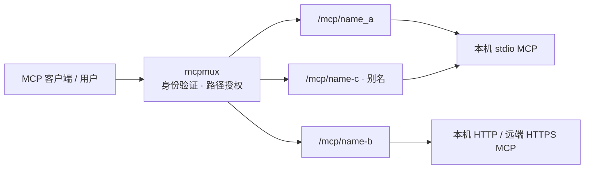

<div align="center">

# mcpmux

**一个域名，多个 MCP 服务，明确的访问权限。**

轻量 Rust MCP 网关 · HTTP / stdio · OAuth + PKCE · TOML 配置

[](https://github.com/TokenNotIncluded/mcpmux/actions/workflows/ci.yml)
[](https://github.com/TokenNotIncluded/mcpmux/releases)
[](LICENSE)

[快速开始](#快速开始) · [配置指南](docs/configuration.md) · [发布版本](https://github.com/TokenNotIncluded/mcpmux/releases) · [报告问题](https://github.com/TokenNotIncluded/mcpmux/issues)

</div>

---

mcpmux 把本机或远端 MCP 服务器映射到同一域名下的独立路径，为每条路径提供身份验证和访问授权。多个用户、客户端和服务通过配置形成多对多关系；客户端连接哪个路径，就使用哪个上游。

项目专注于路由和授权：不聚合工具，不包含计费层或管理后台。管理员编辑 `/etc/mcpmux/mcpmux.toml` 即可管理服务。

## 工作方式


```mermaid
flowchart LR
    C["MCP 客户端 / 用户"] --> G["mcpmux
身份验证 · 路径授权"]
    G --> A["/mcp/name_a"]
    G --> B["/mcp/name-b"]
    G --> D["/mcp/name-c · 别名"]
    A --> S["本机 stdio MCP"]
    B --> H["本机 HTTP / 远端 HTTPS MCP"]
    D --> S
```

每个公开路径都有独立的授权资源与访问权限。别名可以复用上游，但不会绕过授权。也可以设置自定义路径，例如 `/tools`。

## 特性

| 能力 | 实现 |
| --- | --- |
| 路由 | 一个路径对应一个上游，支持多路径复用与别名 |
| 传输 | HTTP / SSE 流式转发、stdio 进程桥接 |
| 认证 | 内置 OAuth 授权码流程，强制 S256 PKCE；支持静态 Bearer 服务令牌 |
| 授权 | 用户与客户端的路径权限取交集，令牌绑定公开路径 |
| 配置 | TOML 文件；启动前校验；上游凭据可从独立文件读取 |
| 资源控制 | 单线程 Tokio；有界并发、消息大小与会话数量 |
| 部署 | x86_64 / aarch64 静态 Linux 发布版，systemd 服务、反向代理示例 |

## 快速开始

### Arch Linux

选择一种安装方式：

```sh
# 发布版静态二进制
paru -S mcpmux-bin

# 或：从 Git 源码构建
paru -S mcpmux-git
```

两个包提供相同的 `mcpmux` 命令，不能同时安装。服务账户和配置目录由 systemd sysusers / tmpfiles 创建。初始化并校验配置：

```sh
sudo mcpmux bootstrap /etc/mcpmux https://mcp.example.com
sudo chown root:mcpmux /etc/mcpmux/mcpmux.toml
sudo chmod 640 /etc/mcpmux/mcpmux.toml
sudo mcpmux check /etc/mcpmux/mcpmux.toml
sudo systemctl enable --now mcpmux
```

安装包不会自动启动服务或生成凭据。`bootstrap` 创建用于连通性检查的内置 echo 上游，秘密保存到 root-only 文件，不输出到日志，也不覆盖已有文件。

### 其他 Linux 发行版

从 [GitHub Releases](https://github.com/TokenNotIncluded/mcpmux/releases) 下载对应架构的 musl 静态二进制及 SHA-256 校验文件，解压并安装：

```sh
sha256sum -c mcpmux-x86_64-unknown-linux-musl.sha256
tar -xzf mcpmux-x86_64-unknown-linux-musl.tar.gz
sudo install -m 755 mcpmux /usr/local/bin/mcpmux
sudo useradd --system --home /var/lib/mcpmux --shell /usr/sbin/nologin mcpmux
sudo install -d -m 750 -o root -g mcpmux /etc/mcpmux
sudo mcpmux bootstrap /etc/mcpmux https://mcp.example.com
sudo chown root:mcpmux /etc/mcpmux/mcpmux.toml
sudo chmod 640 /etc/mcpmux/mcpmux.toml
```

从仓库下载 [systemd 服务文件](packaging/mcpmux.service)，安装后启动：

```sh
sudo install -m 644 packaging/mcpmux.service /etc/systemd/system/mcpmux.service
sudo systemctl daemon-reload
sudo systemctl enable --now mcpmux
```

适用于 Ubuntu、Debian、Fedora、Arch、Alpine 等 Linux 发行版。非 systemd 系统可通过自己的服务管理器运行 `mcpmux serve /etc/mcpmux/mcpmux.toml`。stdio 上游的运行环境需要单独安装。

### HTTPS

mcpmux 默认监听 `127.0.0.1:8088`，由 nginx 或 Caddy 终止 TLS。Caddy 的最小配置：

```caddyfile
mcp.example.com {
    reverse_proxy 127.0.0.1:8088 {
        flush_interval -1
    }
}
```

也提供 [nginx 示例](packaging/nginx.conf)。域名、证书和 TOML 中的 `public_url` 必须一致。HTTP/SSE 转发需要关闭代理缓冲。

## 配置示例

以下片段展示路由方式；完整配置还需添加用户、客户端或服务令牌，见 [配置指南](docs/configuration.md)。

```toml
public_url = "https://mcp.example.com"
listen = "127.0.0.1:8088"

[upstreams.local]
type = "stdio"
command = "/opt/example-mcp/server"
args = ["--data-dir", "/srv/mcp-data"]

[upstreams.remote]
type = "http"
url = "https://upstream.example.com/mcp"
bearer_file = "/etc/mcpmux/remote-bearer"

[routes.name_a]
upstream = "local"

[routes.name-b]
upstream = "remote"

[routes.name-c]
alias = "name_a"
```

修改配置后，先检查再重启：

```sh
sudo mcpmux check /etc/mcpmux/mcpmux.toml
sudo systemctl restart mcpmux
sudo journalctl -u mcpmux -n 30 --no-pager
```

重启会撤销内存中的 OAuth 令牌并结束现有会话。静态服务令牌按配置持久生效，删除对应配置并重启即可撤销。

## 认证与协议

- 每条路径提供 OAuth 受保护资源元数据；未认证请求返回授权发现信息。
- OAuth 授权码流程强制 S256 PKCE，精确匹配回调地址，将令牌绑定到请求的资源。
- 客户端须在 TOML 中预注册；支持自定义 Bearer 的客户端也可使用静态服务令牌。
- 入口凭据不会透传给上游；远端上游的凭据由管理员独立维护。
- HTTP 与 stdio 支持代码实现的 `2026-07-28` 请求模式及旧版初始化会话；不会自动转换协议语义。

动态客户端注册、CIMD、刷新令牌、第三方身份提供商、上游自动 OAuth 登录、旧版独立 `/sse` + `/messages` 传输和 stdio 事件回放目前不支持。详细行为、超时及客户端设置见 [配置指南](docs/configuration.md)。

## 资源与运行边界

默认最多 32 个会话、128 个活动请求，消息大小上限 1 MiB。HTTP 响应流式转发；stdio 进程按请求或会话隔离。附带的 systemd 服务以非 root 用户运行，限制写入位置，并设置 256 MiB 服务内存上限。

这些是配置与保护边界，不是内存性能测量。stdio 子进程的实际资源需求取决于上游实现。

## 开发

```sh
cargo fmt --check
cargo clippy --locked --all-targets -- -D warnings
cargo test --locked
cargo build --locked
python3 tests/e2e.py target/debug/mcpmux
```

| 目录 | 内容 |
| --- | --- |
| `src/` | 网关、认证、配置与传输实现 |
| `tests/` | stdio 测试服务与端到端验证 |
| `packaging/` | systemd、反向代理与 AUR 打包文件 |
| `docs/` | 配置、授权及传输说明 |

欢迎提交问题与 PR。报告错误时请提供版本、脱敏配置和复现步骤，移除访问令牌、密码及上游密钥。

## 许可证

[MIT](LICENSE)
