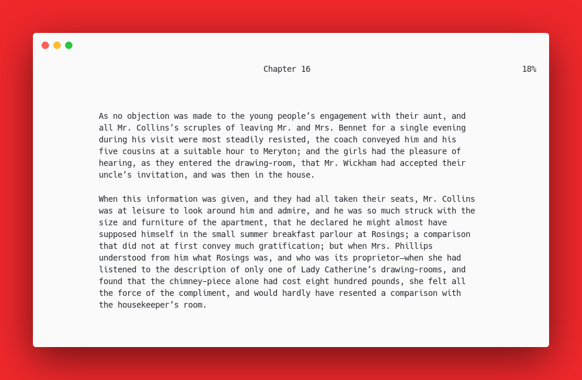

# Tetris CLI

## Description

Tiny tetris game in a terminal

(Linux only!)

Available for Arch on the AUR as [tetris-cli-git](https://aur.archlinux.org/packages/tetris-terminal-git)

## Controls

+ a -> Move left
+ d -> Move right
+ q -> Rotate left
+ e -> Rotate right
+ s -> Instant drop
+ Backspace -> Quit

## Build dependencies

You should just need the [Rust programming language](https://www.rust-lang.org/tools/install) installed and a Linux machine (Windows cmd is bad when it comes to terminal graphics).
